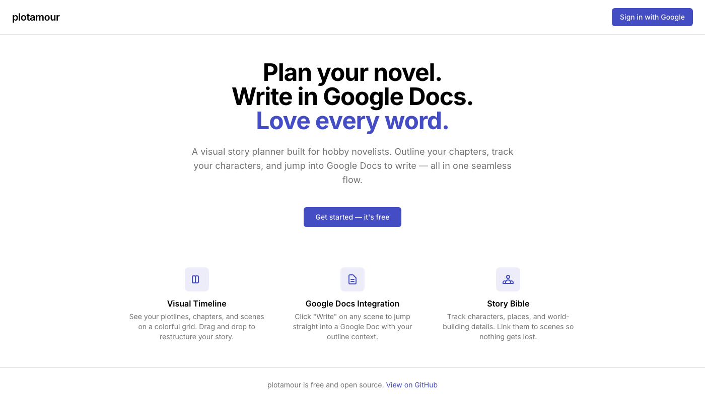

<p align="center">
  
</p>

<h1 align="center">plotamour</h1>

<p align="center">
  <strong>Plan your novel. Write in Google Docs. Love every word.</strong>
</p>

<p align="center">
  A visual story planner built for hobby novelists. Outline your chapters, track your characters, and jump into Google Docs to write — all in one seamless flow.
</p>

<p align="center">
  <a href="https://plotamour.vercel.app">Live App</a> · <a href="#features">Features</a> · <a href="#getting-started">Getting Started</a> · <a href="#tech-stack">Tech Stack</a>
</p>

---

## Features

### 📐 Visual Timeline

A color-coded grid where **chapters** run across the top and **plotlines** run down the side. Drop scenes into any cell to map out your story structure at a glance. Drag and drop to rearrange.

### 📝 Google Docs Integration

Click **"Write"** on any scene and plotamour creates a Google Doc pre-loaded with your outline context — chapter, scene summary, POV character, and more. Word counts and writing status sync back automatically.

### 📖 Outline View

A collapsible, chapter-by-chapter outline that shows your writing progress. Jump directly into the Google Doc for any scene, or see which scenes still need writing.

### 👤 Characters, Places & Notes

Build a story bible alongside your outline. Create characters with custom attributes, track locations, and keep project-wide notes — all linked to the scenes where they appear.

### 🏷️ Tags & Plotlines

Organize with color-coded tags and plotlines. Assign tags to scenes, characters, and places. Track multiple plotlines across your entire story.

### 📚 Series Support

Working on a multi-book series? plotamour supports multiple books within a single project, with a shared cast of characters and locations.

### 📋 Scene Templates

Start scenes from templates like the Hero's Journey beats (Ordinary World, Call to Adventure, etc.) or create your own. Templates inject outline structure so you're never staring at a blank page.

### 📤 Export

Export your full outline as **text**, **HTML**, or **JSON** — with all chapter structures, scene metadata, characters, and places included.

### 📥 Import from Plottr

Migrating from Plottr? Upload your `.pltr` file and plotamour imports everything — scenes, chapters, plotlines, characters, places, notes, and tags — with a preview step before committing.

---

## Tech Stack

| Layer | Technology |
|-------|-----------|
| **Framework** | [Next.js 15](https://nextjs.org/) (App Router, Turbopack) |
| **Language** | [TypeScript](https://www.typescriptlang.org/) |
| **UI** | [React 19](https://react.dev/), [Radix UI](https://www.radix-ui.com/), [Tailwind CSS 4](https://tailwindcss.com/) |
| **Database** | [Supabase](https://supabase.com/) (PostgreSQL + Auth + Row-Level Security) |
| **Drag & Drop** | [@dnd-kit](https://dndkit.com/) |
| **Auth** | Google OAuth via Supabase |
| **APIs** | Google Docs API, Google Drive API |
| **Hosting** | [Vercel](https://vercel.com/) |
| **Testing** | [Vitest](https://vitest.dev/), [Testing Library](https://testing-library.com/) |
| **CI/CD** | GitHub Actions (lint → test → build) |

---

## Getting Started

### Prerequisites

- Node.js 20+
- A [Supabase](https://supabase.com/) project
- A [Google Cloud](https://console.cloud.google.com/) project with OAuth credentials

### 1. Clone & Install

```bash
git clone https://github.com/kevinbuckley/plotamour.git
cd plotamour
npm install
```

### 2. Set Up Supabase

1. Create a new project at [supabase.com](https://supabase.com/)
2. Run the migration in the SQL Editor:
   - Copy the contents of `supabase/migrations/00001_initial_schema.sql`
   - Paste and run in Supabase SQL Editor
3. Enable **Google** as an auth provider:
   - Go to **Authentication → Providers → Google**
   - Add your Google OAuth credentials (Client ID & Secret)
   - Set the redirect URL to `http://localhost:3000/auth/callback`

### 3. Set Up Google Cloud

1. Create a project at [Google Cloud Console](https://console.cloud.google.com/)
2. Enable the **Google Docs API** and **Google Drive API**
3. Create **OAuth 2.0 credentials** (Web application type)
4. Add `http://localhost:3000` as an authorized JavaScript origin
5. Add your Supabase callback URL as an authorized redirect URI

### 4. Configure Environment

```bash
cp .env.local.example .env.local
```

Fill in your values:

```env
NEXT_PUBLIC_SUPABASE_URL=https://your-project.supabase.co
NEXT_PUBLIC_SUPABASE_ANON_KEY=your-anon-key
GOOGLE_CLIENT_ID=your-google-client-id
GOOGLE_CLIENT_SECRET=your-google-client-secret
```

### 5. Run

```bash
npm run dev
```

Open [http://localhost:3000](http://localhost:3000) and sign in with Google.

---

## Project Structure

```
src/
├── app/                    # Next.js App Router
│   ├── (dashboard)/        # Protected routes (projects, timeline, outline, etc.)
│   ├── api/                # API routes (REST endpoints)
│   ├── auth/               # Authentication (login, callback, signout)
│   ├── privacy/            # Privacy policy
│   └── termsofservice/     # Terms of service
├── components/
│   ├── timeline/           # Timeline grid, scene cards, drag-and-drop
│   ├── outline/            # Collapsible outline view
│   ├── characters/         # Character list & detail panels
│   ├── places/             # Place management
│   ├── notes/              # Notes
│   ├── series/             # Multi-book series management
│   ├── templates/          # Scene template browser
│   ├── shared/             # Sidebar, export menu, etc.
│   └── ui/                 # Radix UI primitives (button, card, dialog, etc.)
├── lib/
│   ├── services/           # Business logic (scenes, characters, Google Docs, etc.)
│   ├── db/                 # Supabase clients (server & browser)
│   ├── types/              # TypeScript types
│   └── config/             # Constants & color palettes
├── __tests__/              # Test suite (320 tests across 20 files)
└── styles/                 # Global CSS
```

---

## Testing

```bash
# Run all tests
npm test

# Run with coverage
npm run test:coverage

# Run in watch mode
npm run test:watch
```

The test suite covers all service layers and API routes with **320 tests across 20 files**.

CI runs automatically on every push and pull request via GitHub Actions.

---

## Database

plotamour uses Supabase (PostgreSQL) with **Row-Level Security** — every table is locked down so users can only see and modify their own data.

**Core tables:** `projects` → `books` → `chapters` → `scenes`

**Story bible:** `characters`, `places`, `notes`, `tags`

**Relationships:** Many-to-many links between scenes ↔ characters, scenes ↔ places, and scenes/characters/places ↔ tags

**Google Docs:** `scene_google_docs` tracks document IDs, URLs, word counts, and writing status per scene

Full schema: [`supabase/migrations/00001_initial_schema.sql`](supabase/migrations/00001_initial_schema.sql)

---

## License

This project is open source.

---

<p align="center">
  Made with ❤️ for novelists who plan before they write.
</p>
